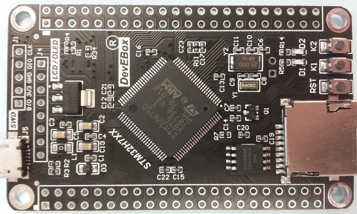

# QUADSPI External Loader for MCUDEV DevEBox H7XX (W25Q64 FLASH)

This is the External Loader for the W25Q64B on the MCUDEV DevEBox H7XX board.
You can use the loader on STM32CubeProgrammer / STM32CubeIDE.

 

## Software
To compile and run it, you need below tools.

- STM32CubeIDE to build .stldr file (I use 1.6.0)
- STM32CubeProgrammer to read memory or write .bin/.hex files (I use 2.7.0)
- Use direcly on STM32CubeIDE to write data to external FLASH on build time.

